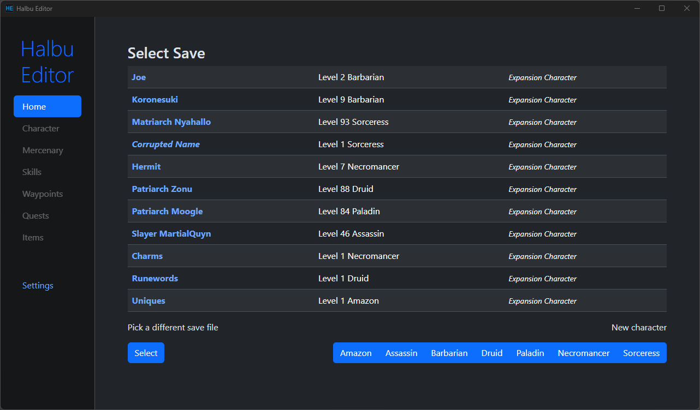

### Halbu Editor


Save Editor for Diablo II Resurrected





###  About

Save Editor for Diablo II: Resurrected.

#### Features

* Edit character stats, mercenary information, quests, skills and waypoints
* Skill calculator
* Modern UI

#### Drawbacks
* Items are not supported yet
* Skill calculator does not support some minions skills (mainly summoner) and contains rounding errors
* Only supports the latest version of D2R (2.7). (Will probably successfully parse 1.10+ D2, but it will save in D2R format so **do not overwrite your saves**.)


### Development

The editor relies on the [halbu](https://github.com/feored/halbu) Rust library to parse save files.
Changes to how .d2s files are parsed and saved should be made there. 

Rust and [Tauri](https://tauri.app/v1/guides/getting-started/prerequisites) are prerequisites.

Install dependencies:
```
$ npm install
```
 
Run in dev mode
```
$ npm run tauri dev
```

The skill calculator relies on a python program (found in `/static/process/`) processing the D2 data text files into easier to parse [json](/blob/main/static/skills_complete.json) containing descriptions and calculations for every skill.


