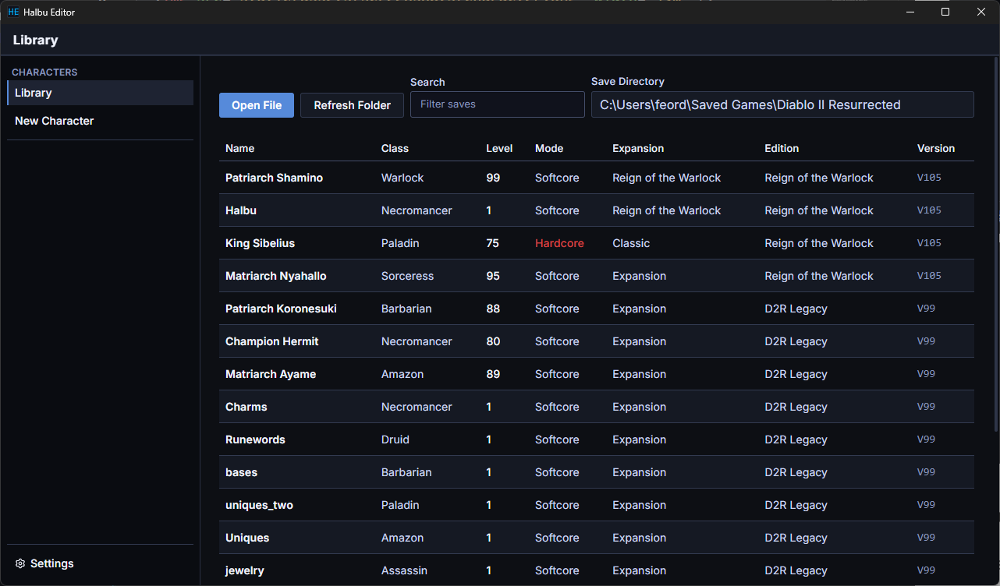
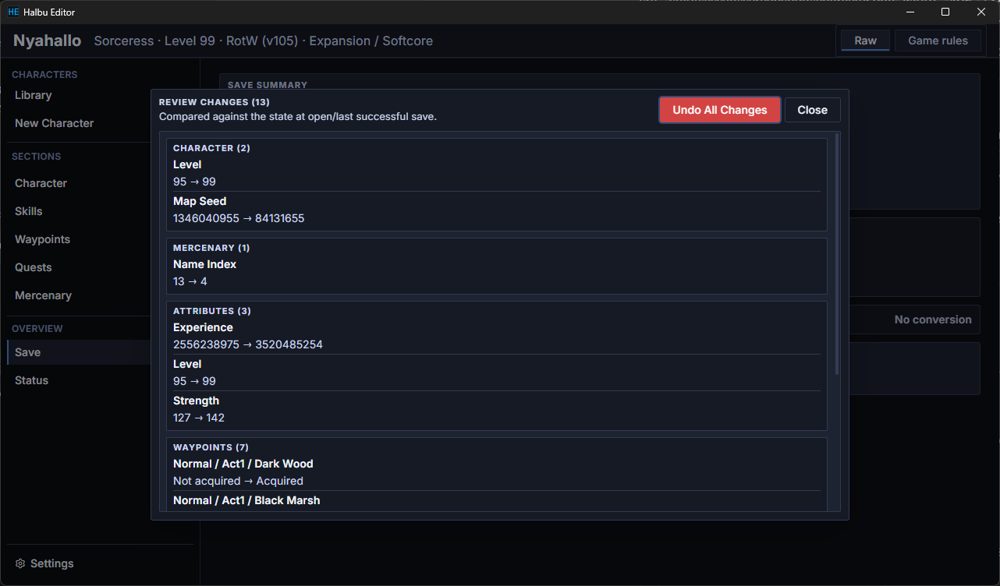
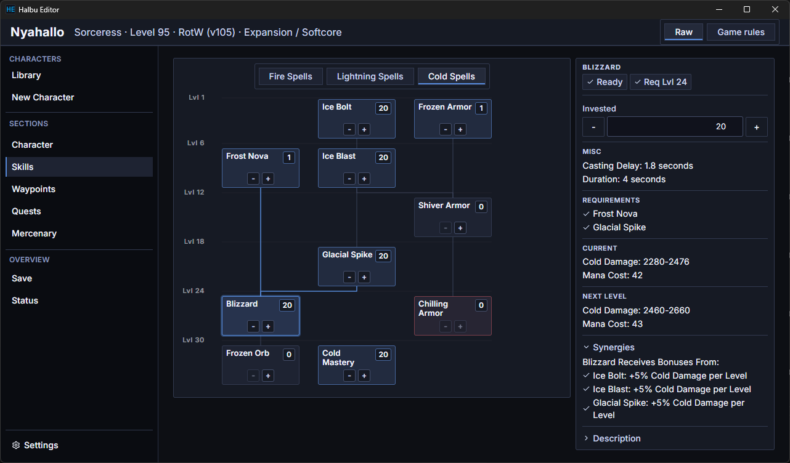

# Halbu Editor



<p float="left">
  
  
</p>

A native save editor for **Diablo II: Resurrected**.

[Download the latest release](../../releases/latest) | [Changelog](CHANGELOG.md)

---

## About

The design goals are: a **fully offline** native editor, graceful handling of mangled saves, compatibility with the latest patches, validation checks to help prevent broken save states, and zero reliance on copyrighted assets (no exocet font or ripped skill icons).

Save parsing and writing is handled by [halbu](https://github.com/feored/halbu), the Rust library the editor is built directly on top of.

## Features

- Safe save workflow with validation, compatibility checks, change review, and automatic backups
- Edit character, skills, quests, waypoints, and mercenary data
- Built-in skill planner/editor
- Create new characters from built-in templates
- Open and manage saves from the character library
- Inspect save metadata and parse issues for broken or mangled saves

## Limitations

- D2R only. Saves from 1.10+ classic D2 may parse correctly, but they will be written back in D2R format. Do not overwrite non-D2R saves.
- No item editing
- Some minion skills display incorrect values and some rounding errors may occur in the skill calculator.

> D2R must be relaunched after saving for changes to take effect.

## Development

Halbu Editor is a [Tauri](https://v2.tauri.app/) application with a [Svelte](https://svelte.dev) frontend. Save parsing and serialization live in the [halbu](https://github.com/feored/halbu) Rust library, so changes to `.d2s` format handling should be made there.

### Prerequisites

- [Rust](https://www.rust-lang.org/tools/install)
- [Tauri prerequisites](https://v2.tauri.app/start/prerequisites/)
- Node.js / npm

### Setup

Initialize the `halbu` submodule and install dependencies:

```sh
git submodule update --init --recursive
npm install
```

### Running

```sh
npm run tauri dev
```

### Building

```sh
npm run tauri build
```

### Testing

Frontend tests currently use Vitest.

Run with:

```sh
npm test
```

### Skill Data Preprocessing 

The skill calculator is backed by versioned JSON files generated from D2 data text files. The preprocessor lives in `/static/tools/preprocess/` and outputs files like:

- `static/data/generated/skills/v99/skills_complete.json`
- `static/data/generated/skills/v105/skills_complete.json`

To regenerate all supported version datasets:

```sh
npm run preprocess:skills
```
