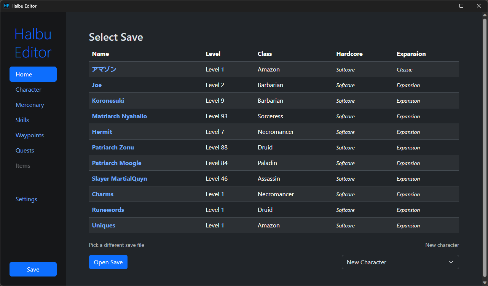

### Halbu Editor


<p float="left">
   
  
</p>


###  About

A save editor for Diablo II: Resurrected.

This project started as a way to learn Rust. The goal is to have a native hero editor for D2R that's easy to use, lets you modify as many things as possible, parses mangled saves gracefully, is up to date with the latest patches,  includes a skill calculator and does not use copyrighted assets (no exocet font, game icons, etc).

#### Features

* Edit your character's stats, mercenary, quests, skills and waypoints
* Easy access to all characters from home page (must set save folder)
* Skill calculator built-in
* Granular quest edition (down to each quest flag, including unused quests)
* New character creation from within the editor
* Clean UI with light/dark theme

#### Drawbacks
* Only supports the latest version of D2R (2.7). (Will probably successfully parse 1.10+ D2, but it will save in D2R format so **do not overwrite your non-D2R saves**.)
* Item parsing/editing not supported yet (next on the roadmap).
* Skill calculator does not support some minions skills (mainly necromancer skeletons/golems) and may contain rounding errors.

D2R will need to be launched again after saving a file for changes to take effect.


### Development

The editor relies on the [halbu](https://github.com/feored/halbu) Rust library to parse save files.
Changes to how .d2s files are parsed and saved should be made there. 

Rust and [Tauri](https://tauri.app/v1/guides/getting-started/prerequisites) are prerequisites.

Install dependencies
```
$ npm install
```
 
Run in dev mode
```
$ npm run tauri dev
```

Build
```
npm run tauri build
```

The skill calculator relies on a python program (found in `/static/process/`) processing the D2 data text files into easier to parse [json](/static/skills_complete.json) containing descriptions and calculations for every skill.


